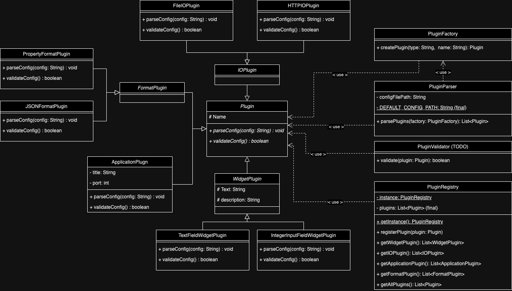

# Architecture Overview

The AnyGUI app follows a layered architecture:

- **Core Layer**: Manages the application logic and backend interactions.
- **[Svelte UI Layer](docs\developer\Webapplication\Architecture.md)**: Handles the user interface, built using Svelte for reactive components and efficient rendering.

Architecture overview of the Configuration Handler

