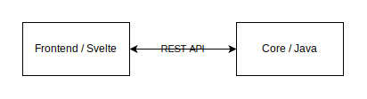

# Architecture Documentation

This document shows in a simple way how our frontend is setup.

## Technology
As Technology we use Sveltekit. Svelte is a modern and versatile Framework which offers several advantages for web development.
For further documentation for Svelte here the official Documentation for Svelte: https://svelte.dev/docs/introduction

## Libraries
Inside the frontend we use several libraries

- **Tailwind**: Tailwind CSS enables fast UI development with minimal custom CSS while maintaining flexibility. https://tailwindcss.com/docs/installation
- **Vite**: Vite is a fast, modern tool that speeds up development and simplifies building front-end applications. https://vite.dev/guide/
- **Playwright**: Playwright is a powerful tool for writing fast, reliable, and scalable browser tests for modern web applications. https://playwright.dev/docs/intro

## Data Flow
For the data flow betwenn the Core and the frontend we use REST API calls.

The calls are gonna have JSON files exchange between the two systems.

## Components
Inside the [Components](anygui\ui\src\lib\components) folder every UI component is defined. For further documentation [here](docs\developer\Webapplication\Components.md).
