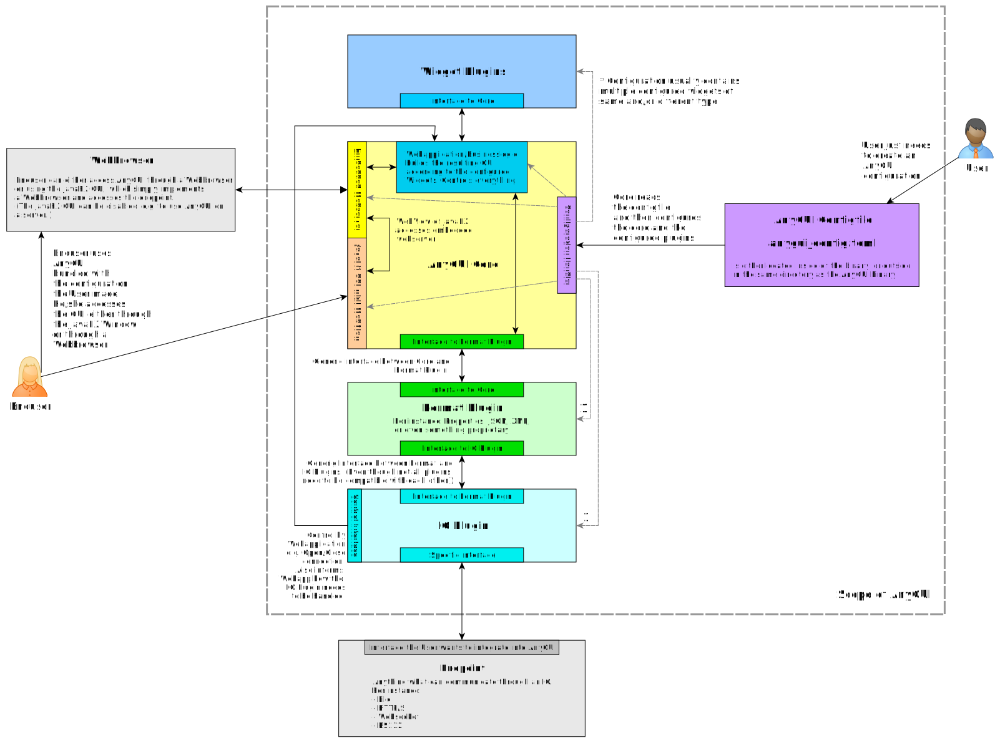

# Specification of AnyGUI

**_With AnyGUI you can build a User Interface for your Clients to control your Machine / Device / Application 
through any Interface and any Protocol._**

## The Problem

Building a User Interface on top of an application is often a problem and many times an underestimated important part. 
How to configure or control a machine through a computer? 
The same problem arises for developers of scripts or backend applications; both should provide a GUI tool to the Enduser 
as well. 
The current results of these concerns are tinkered tools from electrical engineers or manuals on how to connect to a 
device by a serial console. 
Other solutions consist of modifying CSV or properties files. Everything is not really user-friendly, is error-prone and 
hinders the user acceptance. 
Shouldn't there be a Tool, which allows configuring the values, and that's (almost) it? 

## The Idea

The customer (aka Enduser in our following terminology) should get a Desktop tool to communicate with the device. 
This tool can ideally run under any OS.
And it needs to be a Desktop tool, which ideally allows remote access too.
A tool which allows configuring the variables to be displayed in a GUI. 
The IO Interface (e.g. file to persist to or a communication interface), as well as the protocol/format should be 
configurable as well.

## The Solution

### Brief description of the solution

A Java application, which has an embedded webserver and a JavaFX GUI which connects to this webserver. 
Configuration possibility for the Values/Widgets, as well as for the IO (interface) and the format/protocol of the data.
Widgets, IO and Format parts are handled as Plugins. 
The result of this is:

- A Desktop application, even though no Desktop GUI needs to be developed and maintained (except the simple JavaFX 
  Web-Container)
- The application allows remote access — simple access the webserver from any browser
- The values can be configured and mapped to Widgets - while any widget can be added if no suitable one is available
- The IO doesn't matter, it can be a file, a https endpoint or an RS232 interface - if one is missing, it can be added 
  as Plugin as well
- The same applies to the format, it can be JSON, properties, XML or whatever is required. Same her: Implementing a 
  missing one as Plugin is possible too.
- If all the required Plugins are available: **A User of AnyGUI only needs to configure the GUI - The resulting Desktop 
  tool can be implemented and shipped to the customer within minutes !**
- And that's not all: The User of AnyGUI can either implement the configuration directly inside the resulting tool or 
  ship the default binary to the customer, together with the configuration file - that's all for a base use case.
- **AnyGUI is so versatile that it even can be used by itself to create an AnyGUI configfile!** 

### The AnyGUI Parts

The AnyGUI consists of the following parts:

1. **Configuration TOML file**: The one and only file according to which the User can configure AnyGUI. 
   Functioning: The Application searches for a file with the name `anygui_config.tmol` in the same
   directory as the application is located. If it is not there, the one inside the application's resource folder is used.
2. **AnyGUI Core:** Consists as the linchpin of the application. Reads and parses the TOML, Propagates the configuration 
   values to the Plugins, contains the Webserver, Creates the JavaFX GUI, Manages the GUI creation and the data between 
   the plugins. Ensures compatibility between the plugins.
3. **Widget Plugins:** One or more Widgets can be configured. They can provide various functionality, support one or 
   more data types. Some can be read-only. The most complex part here are constraints where some selected values restrict
   other values or hide/show other values. (For instance, in a usage of AnyGUI, a select-one input widget may contain 
   the text-value "Workdays" and if selected, text input fields for Saturday and Sunday must be hided.)
4. **IO Plugins:** One IO Plugin can be configured to use. Its implementation connects to a particular interface, which
   is in the simplest form accessing a local file. But it can also be a http/s endpoint or an RS232 interface.
5. **Format Plugins:** The format according to which the data is exchanged through the UI Plugin between AnyGUI and the 
   endpoint. For instance JSON, XML, properties or even something proprietary. 

### Terminology

- User: The one who uses AnyGUI to configure a GUI.
- Enduser: To distinguish the User from the person who finally uses the configured GUI, we call this person Enduser.
- AnyGUI configfile: The file, which configures AnyGUI, called `anygui_config.toml`. 
  

### Overview Diagram

The following Diagram shows the scope of AnyGUI, as well as all the parts and interfaces between them:

The Diagram shows:

1. Out of what parts the whole application consists
2. The cope of AnyGUI 
3. The difference between the User and the Enduser
4. The values are exchanged bidirectionally: The IO Plugin sends and receives data. The GUI is constantly updated with
   new data, while the values can be changed in the GUI and sent through the Format and IO Plugin.
5. That the Enduser can access the GUI through the JavaFX GUI or through a webbrowser
6. That the JavaGUI can be disabled, so that AnyGUI could also run on a server without a graphical user interface
7. That a configuration always consists of a single Format Plugin and a single IO Plugin but can contain several Widget 
   plugins (what will usually be the case)
8. That the configuration handler configures each part of the application.
9. That the IO Plugin defines how the webapplication needs to handle the IO dependent mechanisms 
   (e.g., connect/persist/etc.), as well as that they communicate with each other for this purpose
10. The interfaces between the Plugins and the core
11. What parts the Core contains and how they interact with each other
12. That the user just needs to write the configfile `anygui_config.toml`
13. The Application searches for a file with the name `anygui_config.tmol` in the same directory as the application is 
  located. If it is not there, the one inside the application's resource folder is used.

### Logical implications

The following aspects lie in the nature of the application itself:

1. Plugins define compatible neighbour-plugins
2. There are global and mandatory config params for each Plugin type. However, a Plugin can have additional specific 
   config params. 
   (e.g., an IO Plugin to connect to a MySQL DB needs additional config params like Username and Password, which a
   simple file Plugin doesn't need.)
3. The application needs to verify the TOML for misconfiguration at startup and warn/error accordingly. Otherwise, the
   behavior of AnyGUI may be undefined.

### The Core

The core consists of:

1. A JavaFX GUI with a WebView, displaying the content the webserver provides
2. An embedded webserver which provides the GUI as webapplication
3. The Webapplication itself: Creates the GUI according to the configured Widgets and communicates with the Format 
   Plugin to exchange data and with the IO Plugin to control the IO Interface.
4. A Configuration handler, which reads and verifies the configfile `anygui_config.toml`. It then passes the 
   configuration values to the corresponding parts: Webapplication, Embedded Webserver, JavaFX GUI, Format Plugin, 
   UI Plugin and to each configured Widget Plugin (the Webapplication/Businesslogic creates the Widget instances which
   are then configured according to what the configuration handler provides.) 
   Config values have implicit default values whenever it makes sense. If it is missing, the default value takes effect.
   The documentation needs to contain all the configuration values with explanation and what's the default value, 
   if it has one. 
5. Interface to the Format Plugin.

### Plugins

#### Widget Plugins

Each widget is configured with a name, as well as with a description (aka hint) which is displayed in the GUI accordingly. 
If a value falls in the warning or error range, this is marked visually. 
The problem of concurrent value updating needs to be solved. If the Enduser changes a value, possible changes since
the start of the value change need to be displayed somehow (e.g. small message below the input field).

The following widgets need to be implemented:

1. Textfield
2. Integer input field
3. Float input field
4. Boolean selection (e.g. as checkbox)
5. Select-one
6. Select-many
7. Gauge (read-only)
8. XY-Chart (read-only)
9. Textarea
10. Textarea read-only, with possible auto-scroll configuration
11. String-outputs (read-only)
12. Table with multiple values and value types and CRUD functionality
13. Later, the following widgets can be added:
    1. File-upload
    2. Graphicfile upload and display
    3. ...

##### Configurable Constraints of Widget Plugins

One of the probably most complicated part is the handling and definition of constraints for widgets. 
Constraints can be:

1. Value ranges (Integers and Float numbers)
2. Value warning ranges (Integers and Float numbers)
3. Value exception ranges: If the warning range is left (Integers and Float numbers)
4. Character lengths (numbers, as well as strings)
5. A boolean selection can enable/disable (or show/hide) other values
6. A selected value in a select-one widget can enable/disable (or show/hide) other values

#### Format Plugins

Each Format Plugin contains a compatibility list which defines to which IO Plugins and which Widget Plugins it is compatible.

The following format plugins need to be implemented:

1. Properties (Key-Value)
2. JSON
3. CSV
4. TOML
5. Later we can add:
   1. XML
   2. Protobuf
   3. MySQL format
   4. ...

#### IO Plugins

Each IO Plugin contains a compatibility list which defines to which Format Plugins and which Widget Plugins it is compatible.

The following IO plugins need to be implemented:

1. File
2. HTTP/S
3. Websocket
4. Later we can add:
   1. RS232 / USB CDC
   2. USB HID
   3. MySQL IO
   4. Interface to directly accessing IOs, like the ones from RaspberryPI
   5. ...

### The JavaFX Window

The JavaFX Window is pretty straight forward: The title contains the URL to which the Enduser also could connect by a 
Webbrowser. The content itself comes from the embedded webserver/webapplication. 
The most "special part" to mention is the fact that the connect/persist/etc. buttons are dependent on the configured 
IO Plugin.

We will provide features to add a logo and configure some header/footer text as well, so that the User can provide a GUI
which looks even more customized.

When the product is in a more mature state, this could be extended even further by templating features, configurable 
colors and fonts, etc.

### Further requirements to meet
1. Max memory footprint: 64 MB (this includes the entire memory usage, not only the heap!)
2. Max binary size (incl. all plugins, which will be implemented until the end of March 2025): 20 MB
3. Browser compatibility: 
   1. Firefox, Google Chrome, Edge
   2. WebView of JavaFX on the OS Linux, macOS, Windows
   3. Smartphones: Apple iOS, Android (Either by a responsive design or any other technique)
4. A Quick Start Guide, as well as a User Manual is required for the User who implements a AnyGUI configfile
5.  A Demo Application is required for each possible plugin combination. This ensures compatibility and provides
   a quick entry point for users of AnyGUI
6. For each Demo Application, a dedicated User Guide is required
7. A Developer Guide is required for future contributors of this project

### Challenges to overcome

The following challenges are the ones that are directly visible at the project start. 
It's almost certain that more will appear during development.

#### Value updating

How to handle concurrent value changes in the GUI, as well as on the endpoint? 
Possible problem scenarios (for simplicity we assume the IO Plugin is a File and the values are placed into Textfields 
in the GUI. The IO Plugin is configured to poll for changes in file.):

- Scenario 1: User changes are overwritten:
  1. The File is read and the values are inserted into the textfields
  2. The user now changes one of the values
  3. Now a new poll of the file occurs → All values are read again from the file → All values in the Textfields are updated 
  4. Problem: Before the Enduser was able to press the "Persist" button, the values were read again and his changes were 
     overwritten → The changes from the Enduser do not take effect 
- Scenario 2: Race condition:
  1. A simple mechanism was implemented which prevents value updating ub the GUI as long as the Enduser modifies a 
     Textfield (including a timeout)
  2. The Enduser makes changes, and due to the mechanism, AnyGUI prevents overriding of his changes
  3. The File is now changed outside AnyGUI (i.e. by the other application which reads/writes these values)
  4. The Enduser now persists the changes
  5. Problem: All values in the file are set to the previous state; to before the File was changed by the "other application"
       → The file is in an inconsistent state, since the changes made by the Enduser are persisted, but all the 
      other updated values are reset to the old values
- Scenario 3: Mechanism to prevent overwriting prevents updating of values:
  1. Assume the same mechanism of Scenario 2
  2. When the user places the cursor in any input field, the updating mechanism is stopped
  3. Problem 1: The GUI is no longer updated
  4. Problem 2: When the Enduser now presses the Persist button, the file can be overwritten with ancient values

#### Constraints

Constraints of values, affecting other values and ranges:
- How to reach the specified goal of constraints?
- How to reference other values in the configfile?
- How to keep it simple but semantically correct for each circumstance to define constraints in the configfile?
- How to prevent circular constraints?
- Is there a standard or known solution to this problem out there?

#### Specifying the format of the Data of the Format Plugin

The format of the data not only needs to be specified, the values need to be mapped as well.
For instance: A JSON string can contain nested objects and arrays. The JSON Format Plugin needs to be configurable
in a way that AnyGUI can identify and map the right value to the corresponding GUI widget. Finding a solution and
implementing it may not be trivial.

#### Webapplication with Dynamic Widgets placing

Webapplication dynamic widgets implementing (aka GUI creation at runtime):
Differently than standard webapplication development, where the input fields are placed statically, AnyGUI
places the widgets and creates the entire GUI dynamically.

#### Bidirectional data exchange

Bidirectional data exchange between GUI widgets and Format, as well as IO plugin: 
To update the values in the GUI, probably an HTTP, as well as a Websocket server needs to be embedded.
 
#### Risk of wrong architecture

It's very crucial to think abstractly when implementing the architecture/interfaces. Otherwise, it constantly needs to 
be redesigned and reimplemented entirely, everytime when a new plugin is added. 
And this effort increases rapidly, as each already available plugin would need to be redesigned and reimplemented as 
well.
 
#### Endpoint testing 

Testing with various IO plugins: For instance, a HTTPS endpoint is required to properly implement a unit test for the 
HTTPS IO plugin. This needs to be implemented in a way that the unit test includes this when it is executed.

#### Configfile sanity checks

The configfile needs to be verified at startup. These sanity checks may not be straight forward. 
For instance: Configured value range and warn range of a value may not overlap. Or only Plugin combinations containing
Plugins which are listed as being compatible are allowed to be configured.

---

### Final Notes

1. To get something done, we currently **disregard the following _ENTIRELY_**:
   1. Security
   2. Authentication
   3. Encryption of the data
   4. UI Test automation: We ensure such tests by building Demo Applications
   5. I18N, we currently implement everything in English
   6. Anything that hinders the development, like project management overhead stuff which blows up the administratively
      effort: It is not required, since:
      1. the specification is already available
      2. the responsibilities/roles are defined specifically to fit what the project requires
      3. even the interfaces and dependencies of other developers are known in advance (see [Overview Diagram](#Overview-Diagram) )
      4. we act flexible according to simple rules: 
         a) The only thing that counts is _directly_ adding value to the project. 
         b) Only contributing to the GitHub repository is considered as directly adding value.
         c) Implement tests and write documentations is part of each developer. 
         d) Once a developer is done with anything: Take over tasks from others. 
   7. User messages: Messages/Notifications e.g. in the form of a popup window, which appears when the IO Plugin 
      receives a message (somehow specified and configured as message, of course).
   8. Sounds on some events.
2. Even though AnyGUI can use itself to create/modify an AnyGUI configfile: When AnyGUI grows, we may later change the 
   format of the AnyGUI configfile from TOML to something else/easier to maintain. But it's a good starting point. And 
   since the TOML file is read-only inside AnyGUI, it's not a dead end to replace the format.